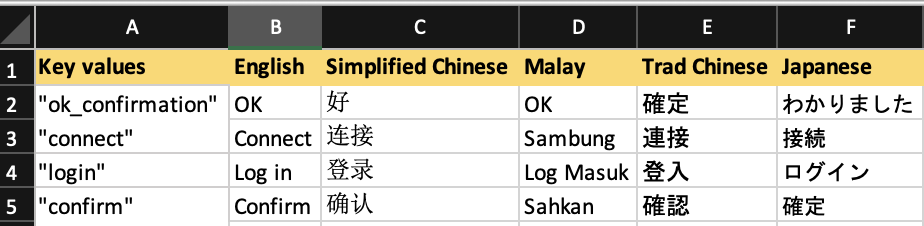
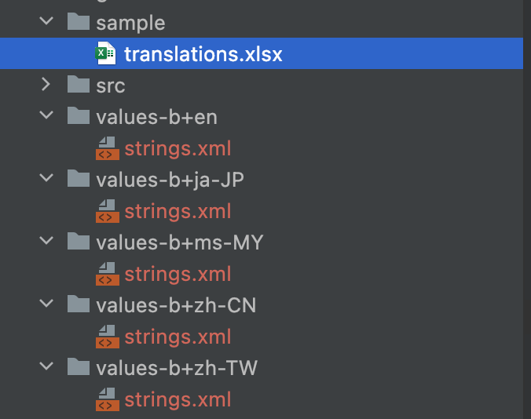
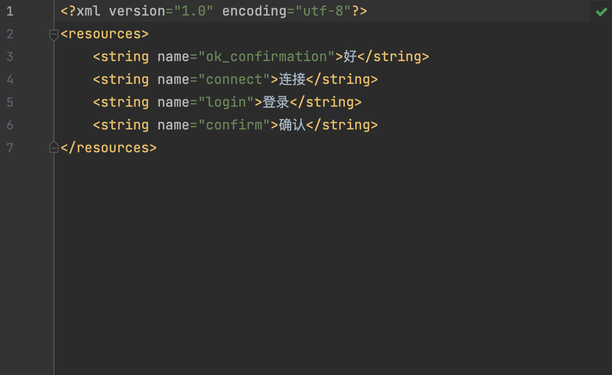

# AndroidXlsParser
A simple parser by reading a Microsoft Excel spreadsheet and generates supported locale ```strings.xml``` files with its own folder

## Sample input
Sample `translations.xls` input file:

<p align="center">
  
</p> 

## Sample output

sample of generated `values-b+zh+CN` folder with  ```strings.xml```file:

<p align="center">
  
   
</p> 


## Pre-requisite
- First Row of the Excel sheet should contains the Locale name
- First column should only contains the string key. Values are to be quoted
- Generated files are defaulted to ```values-R+<language code>+<country code>``` as per specified in [Android Documentation](https://developer.android.com/training/basics/supporting-devices/languages)

## Usage
- Place your excel file on the root directory
- For additional locale support just add the values to the ```LocaleHeader``` enum class
- Replace your excel file name and sheet number to the line ```val sheet = getSheet("sample/translations.xlsx", 0)```
- Run the program
